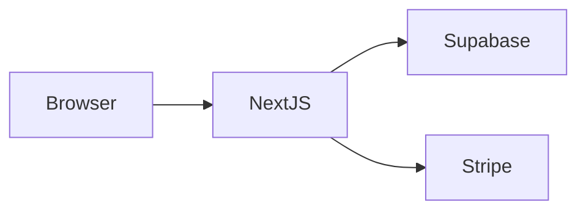

> **DEPRECATED** — v2 location: [`chapters/prompting/10-visuals.md`](../../chapters/prompting/10-visuals.md). Full v1→v2 map: [`V1-CHAPTERS-DEPRECATED.md`](../../V1-CHAPTERS-DEPRECATED.md). Body kept for cross-reference.

# 10 — Visuals: screenshots, mockups, and diagrams

Claude Code is multimodal. Pasting an image often replaces a paragraph of confused description with one clear ground truth.

## When a visual beats words (use them)

1. **Bug reports** — paste a screenshot of the broken UI. "The button is here, but it should be there" with two screenshots > 200 words of explanation.
2. **Design matching** — paste the reference design. "Make it look like this" + image beats any verbal description.
3. **Layout discussions** — ASCII sketches or a quick Figma screenshot. Especially for "where should X go."
4. **Whiteboard scans** — schema sketches, flow diagrams. Claude reads handwriting reasonably well.
5. **Error states from third-party UIs** — paste Stripe Dashboard / Supabase Studio screenshots when the error lives there.

## When words beat visuals (skip the image)

1. **Text errors** — paste the text. Searchable, copyable, Claude can grep its own context. A screenshot of an error message is strictly worse than the message text.
2. **Code in screenshots** — paste the code, not the IDE screenshot.
3. **Logs and stack traces** — paste the text.

Rule: **if you could `Cmd+A, Cmd+C` it as text, do that, not a screenshot.** Images are for things that *aren't* text.

## How to paste a screenshot effectively

In Claude Code (CLI):
- Drag the image file path into the terminal, or
- Use `Cmd+V` if your terminal supports image paste, or
- Reference a path: "see screenshot at `/tmp/bug.png`."

Always pair the image with a one-line description. Don't paste an image and say "fix this" — say:
> Screenshot of the quote list. The status badge should be on the right, not the left. Also the spacing between rows is too tight.

The description focuses Claude's attention. Without it, Claude has to guess what you noticed about the image.

## Multiple screenshots (before/after, comparison)

Powerful pattern:
- Screenshot 1: the current broken state
- Screenshot 2: the reference / target state
- Tell Claude: "match screenshot 2"

For mobile bugs:
- iOS screenshot + Android screenshot side by side ≫ "it looks different on Android"

## Diagrams in markdown files

For your `ARCHITECTURE.md` and design docs:

### ASCII (always works, no rendering needed)

```
┌──────────┐    ┌──────────┐    ┌──────────┐
│  Browser │───▶│  Next.js │───▶│ Supabase │
└──────────┘    └──────────┘    └──────────┘
                      │
                      ▼
                 ┌──────────┐
                 │  Stripe  │
                 └──────────┘
```

Pros: Claude reads them as text, low token cost, version-control friendly.
Cons: ugly, easy to get misaligned.

### Mermaid (renders on GitHub, supported in many viewers)



Pros: cleaner, easier to maintain, renders nicely.
Cons: not visible until rendered (in CLI you're reading the source).

**Recommendation:** ASCII for terminal-readable docs Claude will read often. Mermaid for human-facing docs (README on GitHub).

## Mockups before building

For non-trivial UI, a quick ASCII or rough screenshot mockup *before* the build session is high ROI:

```
┌────────────────────────────────────────┐
│  Quotes                       [+ New]  │  ← header, action right
├────────────────────────────────────────┤
│  [Search.........]  [Status ▾]         │  ← filters
├────────────────────────────────────────┤
│  Klant Janssen     €1,250    ●draft    │
│  Acme BV           €4,800    ●sent     │  ← rows
│  Bakkerij Den B.   €420      ●accepted │
└────────────────────────────────────────┘
```

This is 30 seconds of work and removes 80% of "where should things go" questions in the build session.

## Annotated screenshots

For complex bug reports, annotate the screenshot first (Preview on Mac: Tools → Annotate → Shapes/Text). Circle the broken element, add an arrow with "should be aligned with this." Saves a paragraph.

## Mobile screenshots specifically

For Expo / native work:
- iPhone: `Cmd+Shift+4` then `Space` then click iOS simulator. Saves to desktop.
- Android: emulator screenshot button, or `adb screencap`.
- Real device: standard screenshot, AirDrop to Mac.

Naming them clearly (`expo-quotes-ios-error.png`) helps when you reference them later.

## Visuals in CLAUDE.md and project docs

You *can* put images in markdown files, but Claude Code only sees them if you explicitly reference them by path or paste them. So:

- Put screenshots in `docs/screenshots/` in the project.
- Reference them in `ARCHITECTURE.md` etc. with ``.
- When you want Claude to look at one, say "look at `docs/screenshots/foo.png`."

The image won't auto-load just because it's referenced — Claude has to be pointed at it.

## Common mistakes

- **Screenshot of code** — paste the code as text.
- **Screenshot without description** — Claude has to guess what you noticed.
- **Too much in one image** — five screenshots of one bug ≫ one screenshot trying to show everything.
- **Image is the only context** — pair with the relevant file paths so Claude knows where to look.

## TL;DR

- Pictures > words when it's a visual problem.
- Text > pictures when it's text (errors, logs, code).
- Always pair image with a one-line description.
- ASCII diagrams in project docs cost almost nothing and pay off every session.
- Before-and-after pairs are the highest-leverage visual pattern.
